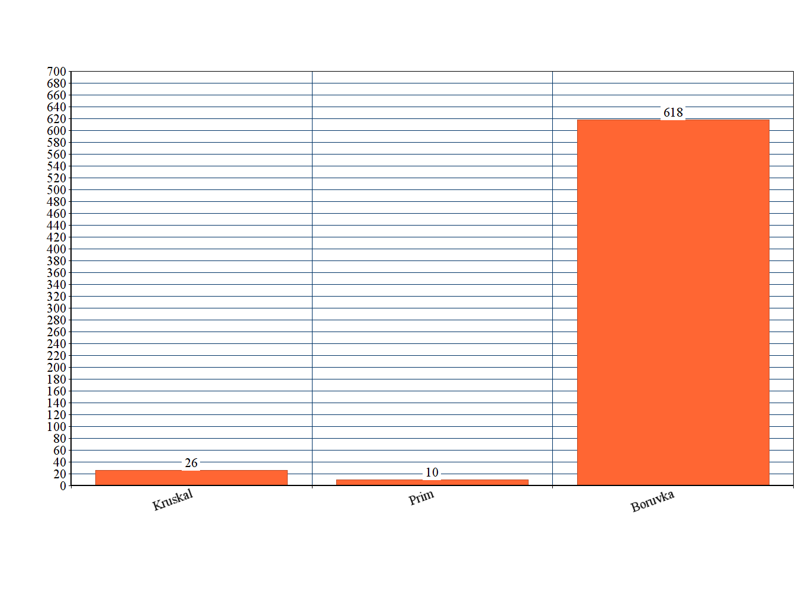
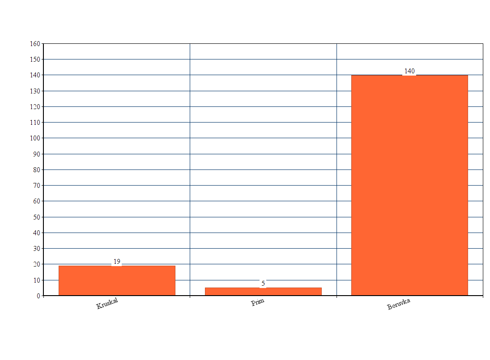
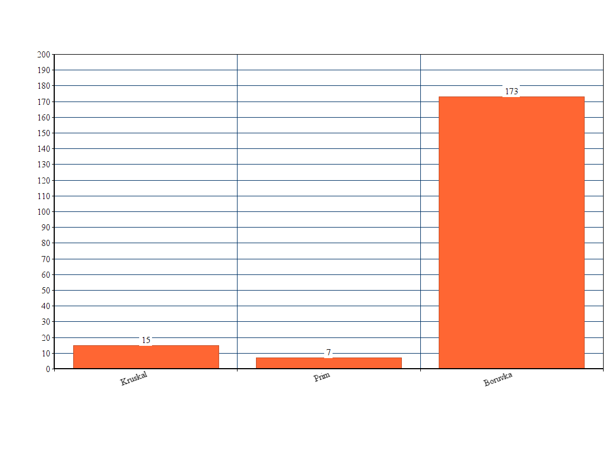

<h1>Testausdokumentti</h1>

<h2>Yksikkötestaus</h2>

<h3>Algoritmien yksikkötestaus</h3>

Algoritmeja on testattu lukuisilla valmiiksi generoiduilla verkoilla. Testaukseen käytetyt verkot löytyvät kansiosta
src/main/resources. Tänne sijoitetaan kaikki verkot, joita halutaan testata, csv. muodossa. Algoritmien testaukseen 
käytetyissä verkoissa on monesti joku erityinen asia, mitä ne testaavat, joka käy usein ilmi sen nimestä, mutta olen kuitenkin
kirjoittanut alle joitakin täsmennyksiä siltä varalta, että ne ovat epäselviä. Todettakoon vielä, että algoritmien yksikkötestaus
on pyrkinyt selvittämään, että algoritmit toimivat helpoissa tapauksissa oikein sekä osaavat toimia yleisissä poikkeustilanteissa,
mitä verkot saattavat sisältää. Alla siis täsmennyksiä:

simpleTest1.csv ja simpleTest2.csv ovat helppoja esimerkkiverkkoja, joilla testasin aluksi, että algoritmit toimivat
oikein pienissä verkoissa, jotka eivät sisällä erikoistapauksia. Olen myös piirtänyt kuvat verkkojen lähtötilanteesta ja 
pienimmistä virittävistä puista, ne löytää kansiosta documentation/images. 

emptyGraph.csv sisältää tyhjän verkon.

singleEdge.csv on yhden kaaren kokoinen verkko.

overlappingEdges.csv on verkko, joka sisältää ainakin kaksi "päällekkäistä" kaarta, eli kaksi kaarta, jotka 
yhdistävät samat solmut. 

preMadeMST.csv sisältää pienen verkon, jonka MST on sama kuin verkko itse.

twoIdenticalEdges.csv dokumentin verkko sisältää kaksi identtistä kaarta.

<h3>Muu yksikkötestaus</h3>

Olen myös laaatinut tavanomaisia JUNIT yksikkötestejä testatakseni tietorakenteiden toimintaa. Lisäksi olen testit sisältävät
GraphCreatorille testin, joka kokeilee, antaako se vain sallittuja arvoja kaarien alku- ja loppusolmuille ja pituuksille. Kaiken
kaikkiaan ohjelmalle on kirjoitettu 40 JUNIT testiä, jotka ovat onnistuneet poikkeuksetta. 

Yksikkötestit voidaan toistaa kätevimmin suorittamalla JNIT testit NetBeansin kautta klikkaamalla yläpalkista 'Test Project', 
mutta toki on olemassa myös vaihtoehtoisia tapoja esim. komentorivin kautta.

<h2> Suorituskykytestit </h2>

Ensiksi todettakoon, että voit itse kokeilla suorituskyvyn testaamista ohjelman tarjoaman PerformanceTester -luokan ansiosta.
Lue käyttöohjeet, jos aiot kokeilla (tai päättele itse).

src/main/resources -kansiosta löytyy largeTest1.csv - largeTest5.csv tiedostot, joita käytin itse suorituskyvyn testaamiseen.
PerformanceTester laskee sadan suorituskerran ajalliset keskiarvot jokaista algoritmia kohden. Olen kirjannut nämä tulokset ylös
ja niitä voi tutkia alla olevista diagrammeista. Listaan alle jokaisen testin syötteiden yksityiskohdat ja tulokset näkyvät
diagrammeista. Käytän seuraavia lyhenteitä: V = solmujen lukumäärä, E = kaarten lukumäärä, L = kaaren pituuden maksimi.

largeTest1.csv (V = 20 000, E, 100 000, L = 20 000)

largeTest2.csv (V = 10 000, E, 100 000, L = 500)

largeTest3.csv (V = 9000, E, 90 000, L = 900)

largeTest4.csv (V = 35000, E, 100000, L = 50)

largeTest5.csv (V = 10000, E, 100000, L = 10)

