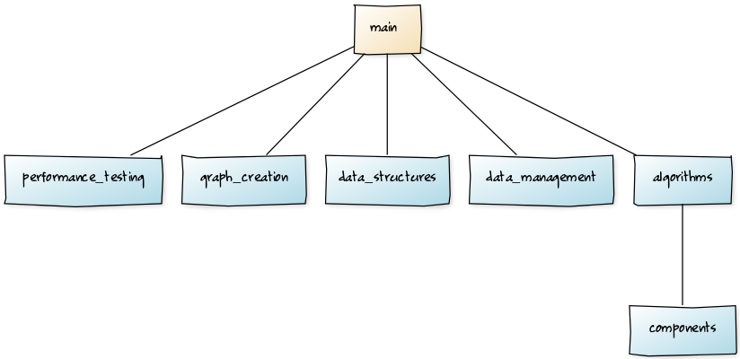
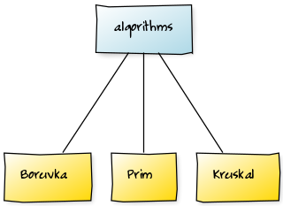
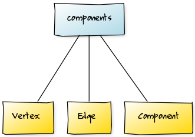
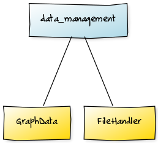
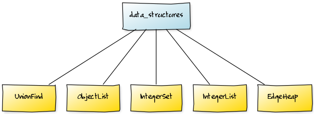

<h1>Toteutusdokumentti</h1>

**HUOM!! Suorituskykyvertailu käy ilmi testausdokumentissa toteutusdokumentin sijaan!**

<h2>Projektin rakenne</h2>

Ohjelmassa toteutetut, vertailun kohteena olevat algoritmit löytyvät pakkauksesta 'algorithms'. 

'components' pakkaus sisältää algoritmeja tukevia luokkia, jotka ovat abstraktioita algoritmeissa tarvittaviin 
käsitteisiin.

'data_management' pakkaus sisältää luokkia, jotka liittyvät tiedostojen lukemiseen, sekä datan tarjoamiseen
algoritmien käyttöön.

Itse toteutetut tietorakenteet, joilla korvataan Javan kirjastoja, löytyvät pakkauksesta 
'data_structures'.

'graph_creation' paketin päämäärä on uusien verkkojen generoiminen.

'main' pakkaus sisältää ohjelman pääluokan ja samalla käyttöliittymän. Se käyttää muiden pakkausten luokkia.

'performance_testing' paketti sisältää suorituskykytestauksesta huolehtivan luokan.

Alla on luokkakaavio projektin paketeista ja sen lisäksi luokkakaaviot projektin paketeista, joissa on enemmän kuin
yksi luokka.

Packages:

Algorithms package:

Components package:

Data Management package:

Data Structures package:

<h2>Aikavaativuudet</h2>

Kruskalin ja Primin tavoilteltu aikavaativuus on O(E log V). En ole laskennallisesti todistanut toteutuuko 
aikavaativuus omissa toteutuksissani, mutta toisaalta kummassakaan (varsinkaan Kruskalin) algoritmissa ei juuri ole
tulkinnanvaraa toteutuksessa ja ne on toteutettu TIRA kurssin ohjeiden mukaisesti. Lisäksi testauksessa tuli ilmi,
että ne näyttäisivät olevan aikavaativuudeltaan samoja, ajassa ilmenee vain pienten vakiokertoimien eroja. Olen 
siis kohtuullisen vakuuttunut, että kyseiset algoritmit toimivat oikeassa aikavaativuusluokassa.

Boruvkan algoritmin aikavaativuuden tulisi käsittääkseni olla sama kuin muussa kahdessa algoritmissa, eli
O(E log V). Oma implementaationi siitä suoriutui testeissä huonommin kuin kaksi kilpakumppaniaan. Esimerkiksi 
largeTest1.csv tiedoston (solmujen määrä 20000, kaarten määrä 100000, kaarten pituus max. 20000) 
suorituskykytesteissä fuksiläppärillä saatiin seuraavat ajat:

Kruskal: 26ms, Prim: 10ms, Boruvka 618ms

Boruvka oli siis tässä esimerkissä kumppaneitaan 20 kertaa hitaampi. Oletan että 20 voidaan vielä lukea 
"vakiokertoimen" piikkiin meneväksi eroksi sen sijaan, että algoritmilla olisi kokonaan toinen aikavaativuusluokka,
mutta itselläni ei ainakaan ole vaadittavia taitoja tämän tiedon selvittämiseksi.

Aikavaativuuksien toteutumisen selvitykseen olisin voinut käyttää kurssilla ehkä enemmän aikaa, sillä nyt se jäi
hieman suurpiirteiseksi. Oletan kuitenkin, että algoritmien tehokkuutta on mielekkäämpää arvioida suoraan 
millisekunteina suorituskykytesteissä.

<h2>Työn puutteet</h2>
  
Ohjelman ehkä ikävin piirre on se, että jos yrittää luoda liian suuren verkon, ohjelma kaatuu, koska aiheutuu outOfMemoryError.
Raja tulee vastaan jo kiusallisen varhain, kun siirrytään syötteisiin, jotka ovat noin 100000 solmun/kaaren pituisia. Epäilen
vahvasti sen liittyvän siihen, että Boruvkan algoritmissa luodaan keko jokaista solmua kohti. Olen asettanut kekojen kooksi
10000 alkiota ja jos tällaisia kekoja luodaan jokaiselle solmulle, niin raja tulee melko pian vastaan. En kuitenkaan ole 
keksinyt ongelmaan ratkaisua, koska periaatteessahan voi olla verkko, jonka kaikki kaaret alkavat samasta solmusta ja silloin
kekojen suuruus voi enintään olla kaarten määrä, jolloin raja tulee vastaan entistäkin varhaisemmin. Olisi pitänyt määritellä
keon koko dynaamisesti, mutta en osannut enkä ehtinyt korjata sitä enää kurssin lopussa. Ehkä siihen olisi löytynyt ratkaisu,
jos kurssi olisi jatkunut pitempään.

Ohjelmassa on mahdollista, että generoituu verkko, jonka kaikki solmut eivät ole yhdistettyjä. Tällöin ohjelma ei onneksi kaadu,
mutta tuottaa väärän tuloksen. Mahdollisuus kasvaa mitä enemmän verkossa on solmuja ja mitä vähemmän siinä on kaaria. Väärä
vastaus on sinänsä ok, koska ohjelma ei ole tarkoitettu sellaisten verkkojen ratkaisemiseen, mutta suurempi ongelma on se, että
ohjelman itse generoimat verkot voivat myös olla sellaisia. Tämän olisi voinut korjata siten, että kävisi verkon läpi jollain
algoritmilla tarkistaen onko se yhtenäinen ja epäkelvon verkon voisi tämän jälkeen hylätä. Aikani ei riittänyt ominaisuuden 
toteuttamiseen.

Harmillinen ongelma ilmaantui, kun loin ensimmäisen kerran jar. tiedoston, nimittäin tällöin tiedostojen nimien tulostaminen
kansiosta näytölle ei toiminutkaan. En löytänyt tähän ongelmaan ratkaisua, joten muutin ohjelmaa niin, että käyttäjän pitää
katsoa olemassa olevien tiedostojen nimet ohjelman ulkopuoliselta listalta.

Eräs puute on myös se, että en tiedä, kuinka .jar tiedoston sisäisiin kansioihin voi lisätä uusia tiedostoja. Näin ollen, jos
käyttäjä haluaisi lisätä omia .csv tiedostoja testattavaksi, voisi olla vaikeuksia saada ne toimimaan .jar tiedoston kanssa.
Toisaalta, jos käyttäjä suostuu ajamaan ohjelmaa Netbeansilla niin hän voi lisätä tiedostonsa src/main/resources kansioon,
jolloin ne toimivat NetBeansin kanssa, mutta eivät releasen .jar tiedostolla, koska .jar tiedoston testidata on sen sisäisissä
kansioissa.
